# Gestion Université - Application Spring Boot

## Description

Application web développée avec Spring Boot pour la gestion des départements et enseignants d'une université. Cette application permet d'effectuer toutes les opérations CRUD (Create, Read, Update, Delete) sur les modules Département et Enseignant.
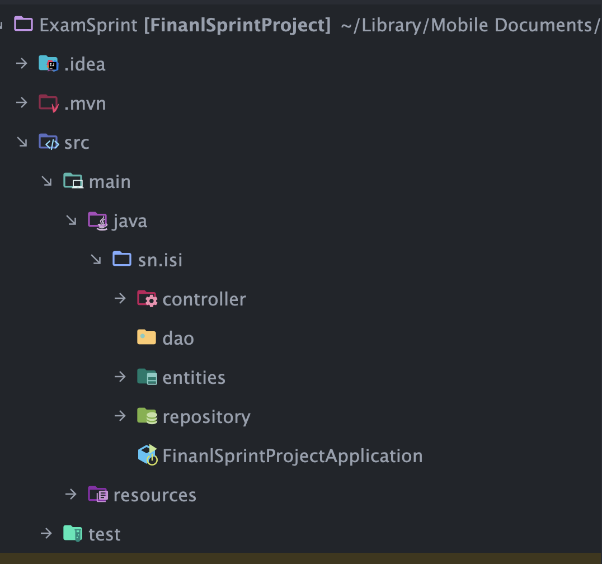
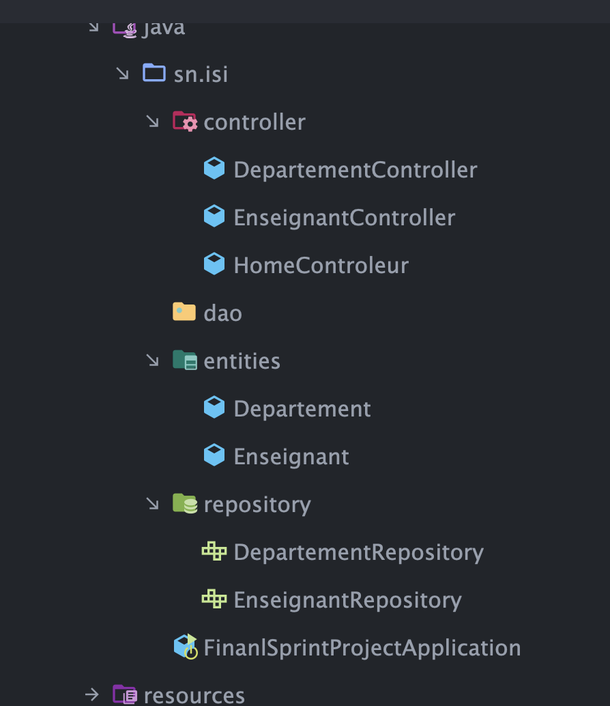
[image4.png](images/image4.png)
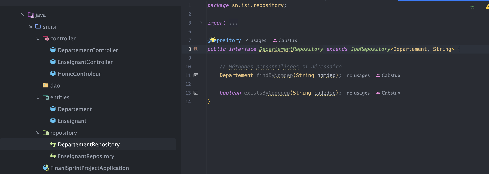
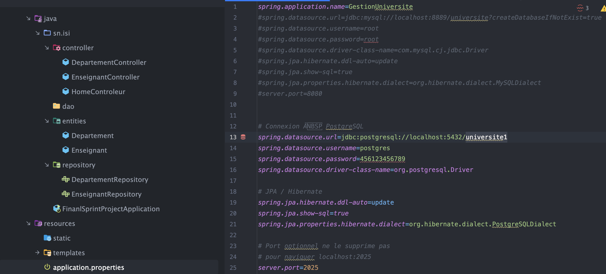
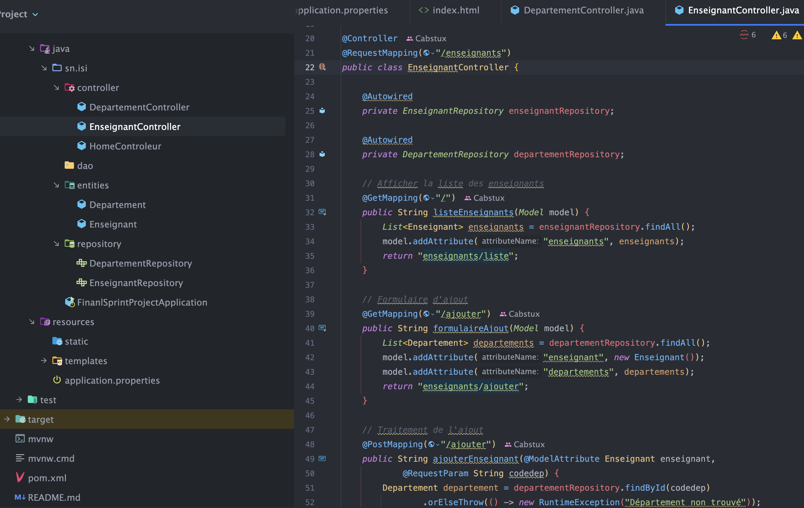
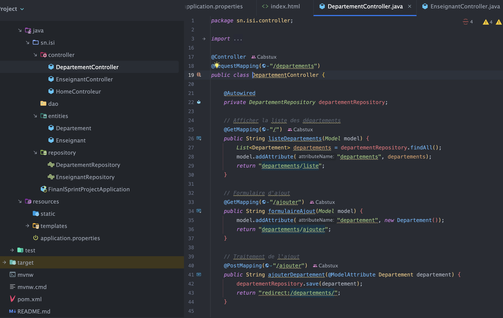
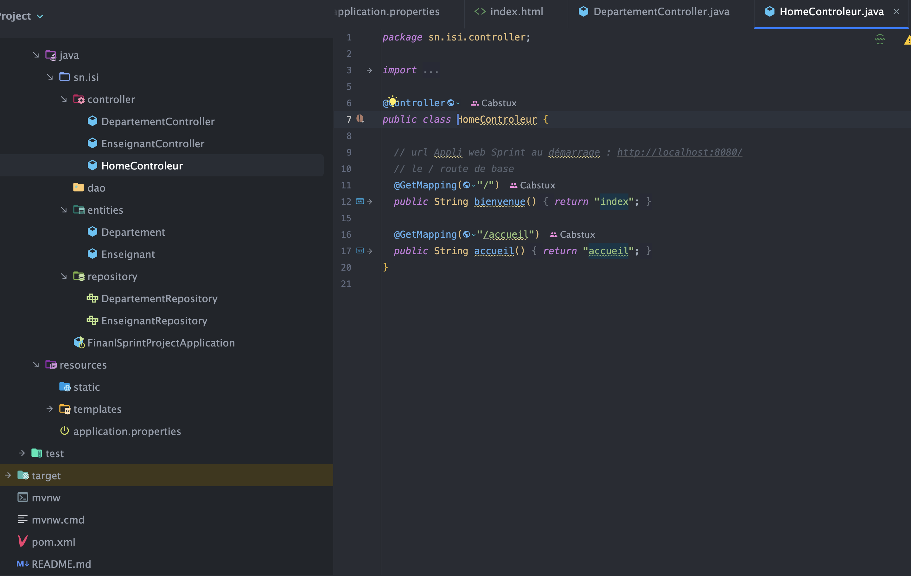
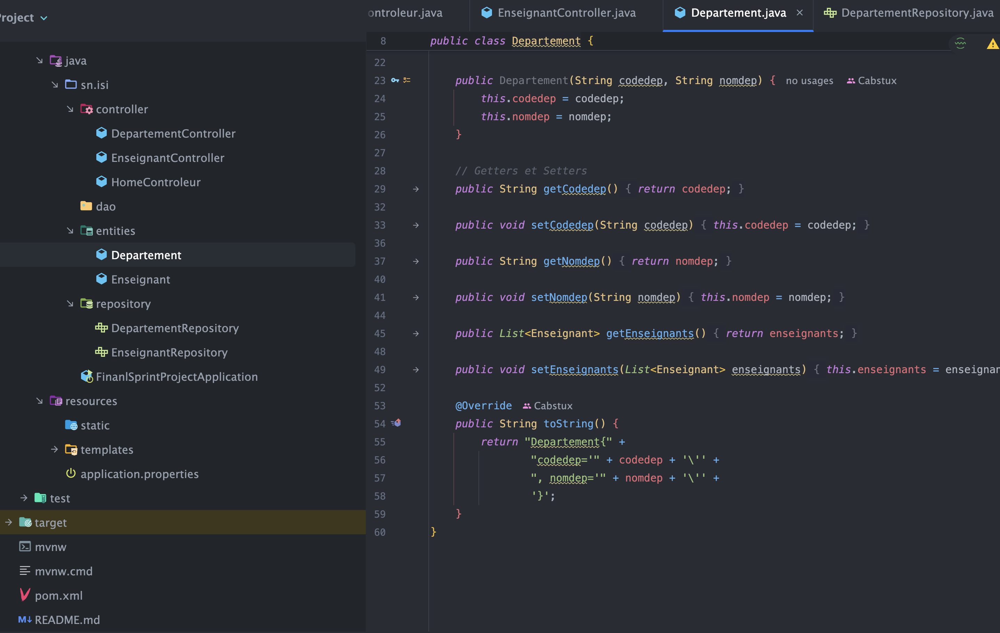
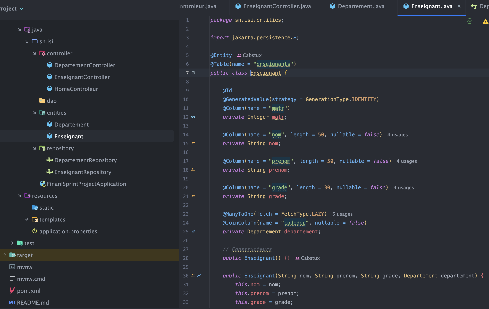
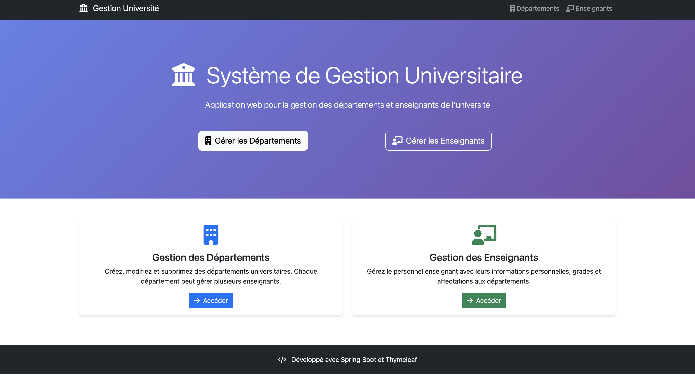
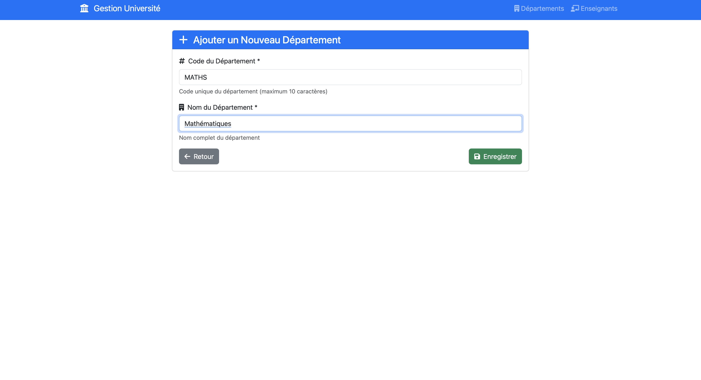
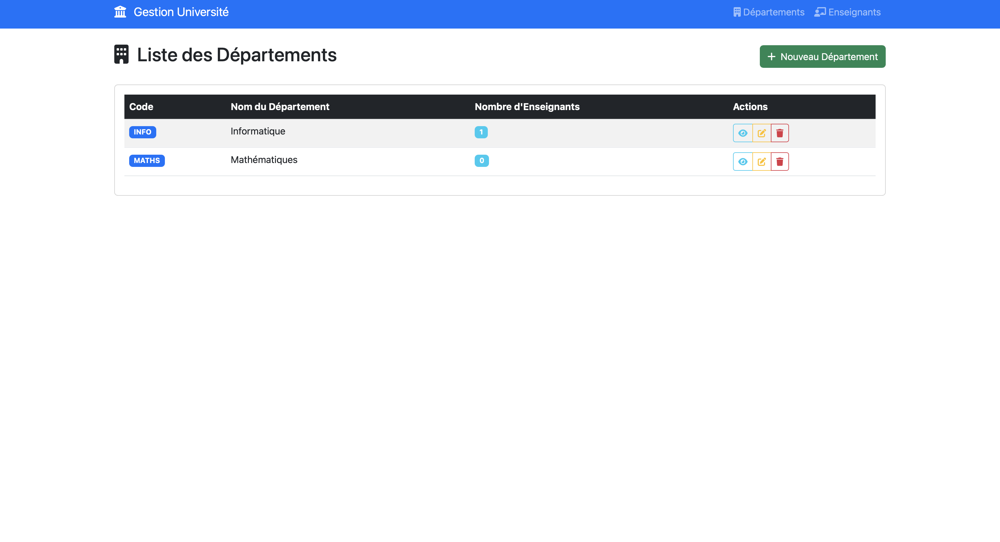
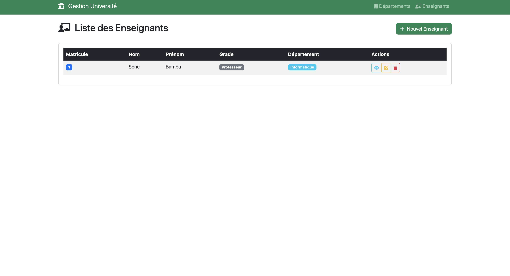
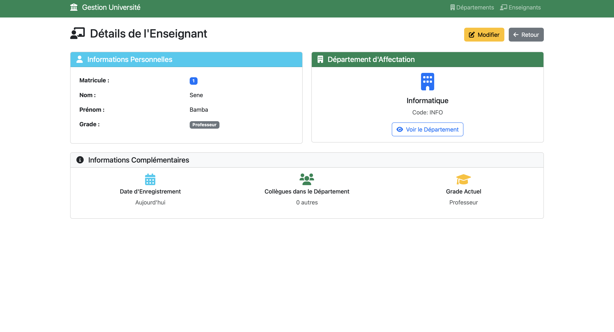
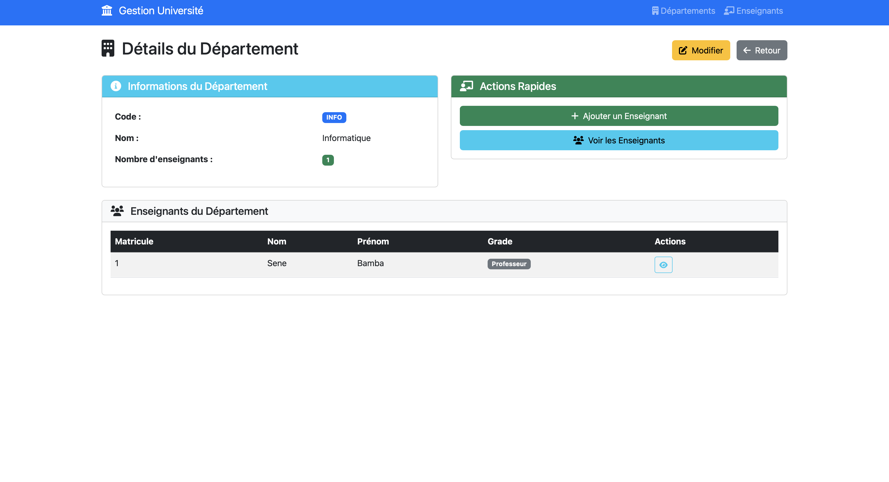
## Auteur
Cheikh Ahmadou Bamba Sene
Développé dans le cadre du Exam final - Classe M1GL - ISI

